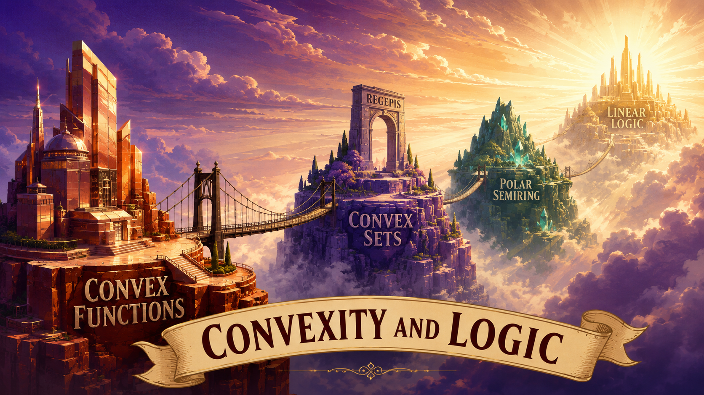

# Convexity, Algebra and Logic

**Author:** Thu-Le Tran — Can Tho University, Vietnam

## Research goal

This research program investigates the structural relationship between **convex geometry**, **convex analysis**, **abstract algebra**, and **linear logic** (Girard). The ambition is not to study any one of these worlds in isolation, but to build **bridges between the models that live in each of them** — the same underlying pattern (a polarity/negation, a meet, a join, and two dual "multiplicative" sums) recurring, provably, across four different languages:

| **Convex Sets** | **Convex Functions** | **Polar Semiring** | **Linear Logic** |
|---|---|---|---|
| Regepis [NEW] | Convex Functions | Polarized Semiring [NEW] | MALL |
| $E^\ast$ (Fenchel polar) | $f^\ast$ (conjugate) | $a^\ast$ (involution) | $A^\perp$ (negation) |
| $(E\cap F)^{\ast\ast}$ (closed meet) | $\max(f,g)$ (pointwise max) | $\mathrm{meet}$ | $A$ with $B$ |
| $(E\cup F)^{\ast\ast}$ (closed join) | $\mathrm{conv}(\min(f,g))$ (convex min) | $\mathrm{join}=\mathrm{meet}^\ast$ | $A\oplus B$ (plus) |
| $(E+_{fib}F)^{\ast\ast}$ (closed fiber sum) | $f+g$ (sum) | $+$ | $A\otimes B$ (times) |
| $(E+_{sp}F)^{\ast\ast}$ (closed spatial sum) | $\mathrm{cl}(f \,\square\, g)$ (inf-convolution) | $+^\ast$ | $A$ par $B$ |

Two columns are old, well-understood territory: **Analysis** (proper closed convex functions, Fenchel conjugation, pointwise sums, infimal convolution) and **Logic** (MALL — the multiplicative-additive fragment of linear logic, with its negation and four connectives). The other two columns are where this program's contribution sits:

- **Geometry — Regepis [NEW].** An intermediate geometric object, the *regepi* (regularized preepi): a subset of an extended space $\overline X = \mathbb R^n \times \overline{\mathbb R}$ that is a fixed point of the Fenchel bipolar closure $E = E^{\ast\ast}$. Every regepi is literally the epigraph of a proper closed convex function, so this column is a faithful geometric mirror of the Analysis column — but its algebra is built from *set-level* primitives (intersection, union, fiber sum, spatial/Minkowski sum, all regularized by $(\cdot)^{\ast\ast}$) rather than from function-level operations.
- **Algebra — Polarized Semiring [NEW].** A minimal, model-independent axiomatization: a set equipped with an idempotent meet, an additive sum, and a polar $(\cdot)^\ast$ satisfying only involution ($a^{\ast\ast}=a$). This column asks, for each row of the table, *how much of the correspondence is forced by the axioms alone* versus how much needs an extra hypothesis (e.g. the absorption/compatibility law) that the geometric model happens to supply for free.

The bridge being built runs **Geometry → Analysis** (regepis reproduce $\Gamma_0(X)$, the classical convex-analytic picture) and **Geometry → Algebra → Logic** (the regepi operations satisfy the polarized-semiring axioms, which in turn force — not merely permit — the MALL distributivity laws and the resulting connective assignment).

**Remark.** The polar $(\cdot)^\ast$ above is one instance of a more general *kernel* construction $E^{\ast_c}$, built from an arbitrary $c:X\times X\to\overline{\mathbb R}$ in place of $\langle x,y\rangle$. Under this lens, linear logic's residual $A\multimap B$ (Girard negation via a dualizing element) and the **$c$-transform** $\varphi^c(y)=\sup_x(c(x,y)-\varphi(x))$ of Kantorovich duality in optimal transport are the *same* nucleus/Galois mechanism as Fenchel polarity, just instantiated at different kernels. Both are the residual of the same adjunction, one written multiplicatively, one written analytically:

$$G\otimes E\le F\ \iff\ G\le E\multimap F \qquad\text{(linear logic, tensor } \otimes\text{)}$$
$$f\,\square\,g\ge h\ \iff\ g\ge f\multimap h \qquad\text{(convex optimization, inf-convolution } \square\text{)}$$

Specializing $f=\delta_A,\ h=\delta_B$ (convex indicator functions), the residual $\delta_A\multimap\delta_B$ appears to collapse to the indicator of a **Minkowski subtraction (erosion)** of sets:
$$\delta_A\multimap\delta_B\ \overset{?}{=}\ \delta_{B\ominus A},\qquad B\ominus A:=\{z: z+A\subseteq B\}.$$
To be checked against the residual/kernel machinery above before stating as a theorem.

## Repository contents

- [`ideas/proofs/try4-semiring/`](ideas/proofs/try4-semiring/) — the current, active chain of documents constructing the table above:
  - [`d1-from-algebra-to-logic.md`](ideas/proofs/try4-semiring/d1-from-algebra-to-logic.md) — the **Algebra** column in isolation: the polarized-semiring axioms and exactly what they force versus what they don't.
  - [`d2-from-geometry-to-algebra-main-v2.md`](d2a-from-geometry-to-algebra-main-v2.md) — the **Geometry → Algebra** bridge: regepis built from the Fenchel relation, shown to satisfy the polarized-semiring axioms.
  - [`d2b-research-program-fiber-sum-closure.md`](ideas/proofs/try4-semiring/d2b-research-program-fiber-sum-closure.md) — an in-depth research program on the single hardest lemma of `d2` (closure of fiber sum on regepis).
  - [`d3-from-function-to-geometry.md`](ideas/proofs/try4-semiring/d3-from-function-to-geometry.md) — the **Geometry ↔ Analysis** bridge: regepis identified with $\Gamma_0(X)$, and the geometric operators read back as $\max$, closed $\min$, sum, and closed inf-convolution.
  - [`remark_properness_and_residual_for_full_MALL.md`](ideas/proofs/try4-semiring/remark_properness_and_residual_for_full_MALL.md) — open questions still standing between the current results and a full MALL model (properness, residuation).
  - [`readme.md`](ideas/proofs/try4-semiring/readme.md) — folder-level summary of the above.
- [`ideas/proofs/old/`](ideas/proofs/old/) — the full history of earlier drafts (four successive stages, `try0-ideas` → `try3-algebra-proofs`) leading up to the current construction; see [`readme.md`](ideas/proofs/old/readme.md) for a guided tour.
- [`ideas/canvas/`](ideas/canvas/) — mind maps (Obsidian canvas).
- [`publish/important-notes/`](publish/important-notes/) — manuscripts prepared for publication, mirroring the most load-bearing documents above.

The original expository paper for this program is on ResearchGate:

> **Convex Analysis and Linear Logic: A Research Program**
> https://www.researchgate.net/publication/409029735_Convex_Analysis_and_Linear_Logic_A_Research_Program
