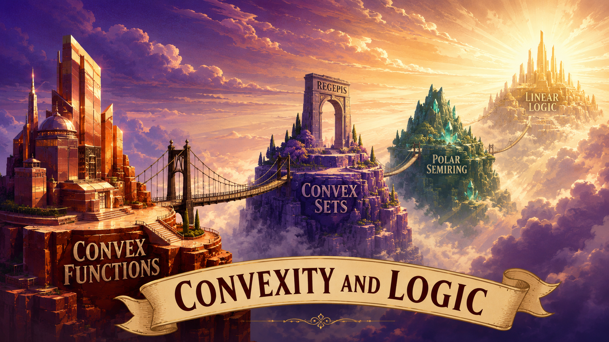

# Convexity, Algebra and Logic

**Author:** Thu-Le Tran — Can Tho University, Vietnam

## Table of contents

- [Part 1 — Objectives](#part-1--objectives)
  - [1.1 Research goal](#11-research-goal)
  - [1.2 The guiding table](#12-the-guiding-table)
- [Part 2 — Contents](#part-2--contents)
  - [2.1 Abstraction layer — new mathematical spaces](#21-abstraction-layer--new-mathematical-spaces)
  - [2.2 Representation layer — pulling the abstraction back down](#22-representation-layer--pulling-the-abstraction-back-down)
- [Part 3 — Structure](#part-3--structure)
  - [3.1 Repository structure](#31-repository-structure)
  - [3.2 Log](#32-log)

---

## Part 1 — Objectives

### 1.1 Research goal

This research program investigates the structural relationship between **convex geometry**, **convex analysis**, **abstract algebra**, and **linear logic** (Girard). The ambition is not to study any one of these worlds in isolation, but to build **bridges between the models that live in each of them** — the same underlying pattern (a polarity/negation, a meet, a join, and two dual "multiplicative" sums) recurring, provably, across four different languages.

The original expository paper for this program is on ResearchGate:

> **Convex Analysis and Linear Logic: A Research Program**
> https://www.researchgate.net/publication/409029735_Convex_Analysis_and_Linear_Logic_A_Research_Program

### 1.2 The guiding table

| **Convex Sets** | **Convex Functions** | **Polar Semiring** | **Linear Logic** |
|---|---|---|---|
| Regepis [NEW] | Convex Functions | Polarized Semiring [NEW] | MALL |
| $E^\ast$ (Fenchel polar) | $f^\ast$ (conjugate) | $a^\ast$ (involution) | $A^\perp$ (negation) |
| Meet $E\wedge F$ | $\max(f,g)$  | $a\oplus b$ | $A\oplus B$ (plus) |
| Join $E\vee F$ | $\mathrm{conv}(\min(f,g))$  | $a\text{ with } b$ | $A\text{ with } B$ (with) |
| Fibor $E\triangle F$ | $f+g$  | $a\otimes b$ | $A\otimes B$ (tensor) |
| Spator $E\bigtriangledown F$ | $\mathrm{cl}(f \,\square\, g)$  | $a\ \text{ par }\ b$ | $A$ par $B$ |
| $e_\wedge$ | $f\equiv-\infty$ | $e_\oplus$ | $\mathbf 0$ (unit of plus) |
| $e_\vee$ | $f\equiv+\infty$ | $e_{\text{with}}$ | $\mathbf T$ (unit of with) |
| $e_\triangle$ | $f\equiv 0$ | $e_\otimes$ | $\mathbf 1$ (unit of tensor) |
| $e_{\bigtriangledown}$ | $\delta_{\{0\}}$ | $e_{\text{ par }}$ | $\bot$ (unit of par) |

Two columns are old, well-understood territory: **Analysis** (proper closed convex functions, Fenchel conjugation, pointwise sums, infimal convolution) and **Logic** (MALL — the multiplicative-additive fragment of linear logic, with its negation and four connectives). The other two columns — **Geometry** and **Algebra** — are where this program's contribution sits, and are developed in Part 2.

The bridge being built runs **Geometry → Analysis** (regepis reproduce $\Gamma_0(X)$, the classical convex-analytic picture) and **Geometry → Algebra → Logic** (the regepi operations satisfy the polarized-semiring axioms, which in turn force — not merely permit — the MALL distributivity laws and the resulting connective assignment).

---

## Part 2 — Contents

### 2.1 Abstraction layer — new mathematical spaces

*This is where new theory is generated.*

- **Geometry — Regepis [NEW].** An intermediate geometric object, the *regepi* (regularized preepi): a subset of an extended space $\overline X = \mathbb R^n \times \overline{\mathbb R}$ that is a fixed point of the Fenchel bipolar closure $E = E^{\ast\ast}$. Every regepi is literally the epigraph of a proper closed convex function, so this column is a faithful geometric mirror of the Analysis column — but its algebra is built from *set-level* primitives (intersection, union, fiber sum, spatial/Minkowski sum, all regularized by $(\cdot)^{\ast\ast}$) rather than from function-level operations.

- **Algebra — Polarized Semiring [NEW].** A minimal, model-independent axiomatization: a set equipped with an idempotent meet, an additive sum, and a polar $(\cdot)^\ast$ satisfying only involution ($a^{\ast\ast}=a$). This column asks, for each row of the table, *how much of the correspondence is forced by the axioms alone* versus how much needs an extra hypothesis (e.g. the absorption/compatibility law) that the geometric model happens to supply for free.

- **Algebra of Four Operators [OBSERVATION].** A proposed unifying algebraic framework built around four primitive operations arranged into two geometric-dual pairs: the lattice pair $(\vee,\wedge)$ and the monoidal pair $(\otimes,\oplus)$. Rather than classifying structures by axioms alone, this viewpoint emphasizes their *distribution profile* — the pattern of distributive interactions between the four operators. Many familiar algebras appear naturally as degenerations obtained by identifying operators or removing distributive links, providing an architectural perspective on their relationships.

  

### 2.2 Representation layer — pulling the abstraction back down

**Remark: kernels and the $c$-transform.** The polar $(\cdot)^\ast$ above is one instance of a more general *kernel* construction $E^{\ast_c}$, built from an arbitrary $c:X\times X\to\overline{\mathbb R}$ in place of $\langle x,y\rangle$. Under this lens, linear logic's residual $A\multimap B$ (Girard negation via a dualizing element) and the **$c$-transform** $\varphi^c(y)=\sup_x(c(x,y)-\varphi(x))$ of Kantorovich duality in optimal transport are the *same* nucleus/Galois mechanism as Fenchel polarity, just instantiated at different kernels. Both are the residual of the same adjunction, one written multiplicatively, one written analytically:

$$G\otimes E\le F\ \iff\ G\le E\multimap F \qquad\text{(linear logic, tensor } \otimes\text{)}$$
$$f\,\square\,g\ge h\ \iff\ g\ge f\multimap h \qquad\text{(convex optimization, inf-convolution } \square\text{)}$$

Specializing $f=\delta_A,\ h=\delta_B$ (convex indicator functions), the residual $\delta_A\multimap\delta_B$ appears to collapse to the indicator of a **Minkowski subtraction (erosion)** of sets:
$$\delta_A\multimap\delta_B\ \overset{?}{=}\ \delta_{B\ominus A},\qquad B\ominus A:=\{z: z+A\subseteq B\}.$$
To be checked against the residual/kernel machinery above before stating as a theorem.

**Open question: properness and the choice of $\overline{\mathbb R}$.** Whether $\overline{\mathbb R}$ is taken to include $-\infty$ or not changes whether regepis can represent *improper* convex functions, which in turn affects whether the Geometry → Algebra bridge can reach a **full** MALL model (all four units, both distributivities) or only a properness-restricted fragment. See `remark_properness_and_residual_for_full_MALL.md` for the current state of this question — it is listed here as open rather than resolved.

---

## Part 3 — Structure

### 3.1 Repository structure

- **`data/`** — the correspondence table and images used across the documents.
- **`code/`** — computational side of the project: Mace4 / Prover9 model-checking scripts and Python utilities. Not yet stable — expect breaking changes.
- **`ideas/`** — the working drafts, in Markdown, under continuous and unstable development. This is where new arguments are tried, revised, and sometimes abandoned; not meant to be read as a finished text.
- **`publish/`** — the polished, shareable side of the project. This is where to look for the newest ideas in a readable form — visitors and collaborators are invited to start here.

### 3.2 Log

*Most recent first.*

- **2026-07-12** — Research program formalized and shared publicly (see ResearchGate link in Part 1).
- The **Polar Semiring** axiomatization (Part 2.1) is under active refinement — expect the axiom set and the "what's forced vs. what needs extra hypotheses" analysis to keep tightening.
